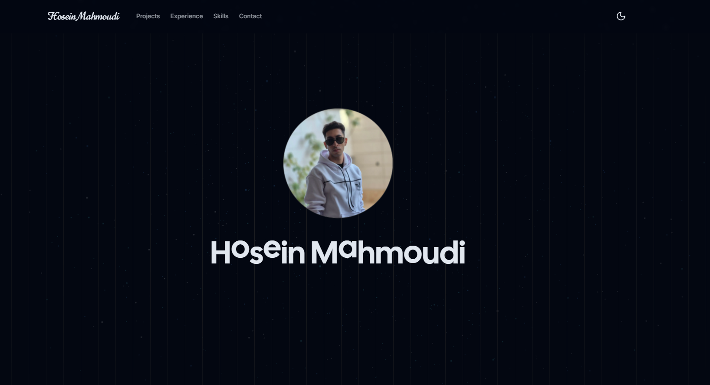

<div align="center">

[](https://git.io/typing-svg)

<br>

<a href="https://hosein-mahmoudi.vercel.app" target="_blank">
  
</a>

<br>

<a href="https://hosein-mahmoudi.vercel.app" target="_blank">
  
</a>

<br>

<!--
<a href="https://hosein-mahmoudi.vercel.app" target="_blank">
  
</a>
-->

> ⚡ Smooth animations · Pixel-perfect UI · Built to impress

<br/>

[](mailto:hoseinmdev@gmail.com)
&nbsp;
[](https://t.me/TinowTinow)

</div>

---

## ⚡ About Me

```yaml
name:        Hosein Mahmoudi
role:        Front-End Developer
location:    Remote 🌍
focus:       Next.js · React · TypeScript
passion:     Animations · Clean Code · Fast UX
status:      Open to work 🟢
````

---

## 🔧 Tech Stack

### Core


### Frameworks & State


### UI & Animation


### Tools


---

## 🌱 Currently Learning


---

## 📊 GitHub Stats

<div align="center">


</div>

<div align="center">


</div>

---

<div align="center">


</div>

---


```
